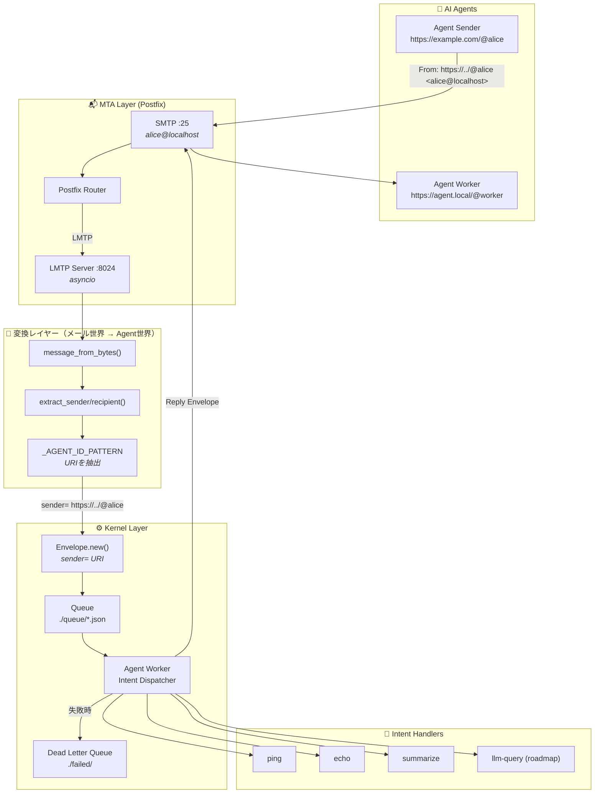

# AI Agent Hub: An MTA-based OS Layer for Decentralized AI Agents

[](https://opensource.org/licenses/MIT)
[](#2-core-architecture)
[](https://www.python.org/)

AI Agent Hubは、30年以上の実績を持つメール転送エージェント（MTA）のアーキテクチャを、**高信頼な非同期メッセージバス**として再定義したプロジェクトです。

分散型AIエージェント間の通信・タスク管理・状態遷移を制御するための **メッセージ指向 OS レイヤー** を提供します。

---

## 1. Motivation: Why MTA?

現代の AI Agent オーケストレーション（Webhook, REST API, gRPC等）には、実用化において以下のクリティカルな課題が存在します。

- **信頼性の欠如**: 通信エラー時の再送処理、指数バックオフ、キューイングの実装がアプリケーション側に委ねられており、データの消失リスクが常に伴う。
- **状態管理の複雑化**: 非同期タスクの実行ログやトレースが分散し、事後的な監査やデバッグが困難。
- **スケーラビリティの限界**: スパイク的なタスク増加に対し、バッファリング層が不十分。

AI Agent Hub は、Postfix/LMTP のエコシステムを「OSのプロセス間通信（IPC）」に転用することで、これらの課題をプロトコルレベルで解決します。

### The Advantages

- **Guaranteed Delivery**: MTAの再送・キュー管理機構により、エージェントがオフラインでもメッセージを確実に保持。
- **Envelope-based Unified Format**: 全てのAIアクションを「封筒（Envelope）」に封入し、監査ログとして永続化。
- **Protocol as an Interface**: SMTP/LMTPを抽象化レイヤーとすることで、言語やプラットフォームを問わない自律分散OSを実現。

AI Agent Hubはこれを**プロトコルレベルの不変ログ**で解決します：

## 2. Core Architecture

本プロジェクトは、Postfixを「メッセージルータ」として、独自Handlerを「OSカーネル」として位置づけています。

### Pipeline Flow



### 変換レイヤーの設計思想

本システムの重要な設計ポイントとして、**メール世界とAgent世界の橋渡し**があります。

SMTPの`From:`/`To:`ヘッダはメールアドレス（`alice@localhost`）ですが、Envelopeが扱うのはエージェントのURI（`https://example.com/@alice`）です。`_AGENT_ID_PATTERN` はこの変換を担う接着剤であり、「SMTPをトランスポートとして使いながら、意味的にはURIベースのエージェント通信を行う」という設計を支えています。

```
From: https://example.com/@alice <alice@localhost>
        ↓ _AGENT_ID_PATTERN
sender = "https://example.com/@alice"
```

---

## 3. Key Concepts

### Envelope Model

全ての通信は以下の構造を持つ Envelope 型で定義されます。AI間の「会話」はすべてスレッド化され、トレーサビリティを確保します。

```json
{
  "id": "uuid-v4",
  "sender": "https://example.com/@researcher",
  "recipient": "https://agent.local/@executor",
  "envelope_type": "TASK_EXECUTION",
  "payload": {
    "intent": "summarize",
    "text": "Extract business insights from recent PRs"
  },
  "context": {
    "thread_id": "tx_9987",
    "in_reply_to": "uuid-v3",
    "priority": "high"
  },
  "created_at": "2026-02-18T23:00:00Z",
  "version": "1.0"
}
```

### Intent Handlers

Agent Worker はペイロードの `intent` フィールドに基づいてハンドラを振り分けます。現在実装済みのintentは以下の通りです。

| Intent | 説明 |
|---|---|
| `ping` | 疎通確認 |
| `echo` | テキストをそのまま返す |
| `summarize` | テキストを要約して返す |
| `help` / `list-intents` | 利用可能なintent一覧を返す |

### High Durability & Auditability

MTA をバックボーンに据えることで、インフラ障害時でもメッセージの整合性を保証します。金融機関や大規模基盤で培われた「確実に届ける」技術のAI領域への応用です。

---

## 4. Roadmap & Future Visions

- **ActivityPub Federation**: エージェントIDが既に `https://domain/@name` 形式を採用しており、分散SNSプロトコルを拡張したAIエージェント間の「フォロー/パブリッシュ」モデルへの発展を想定。
- **Serverless Scaling**: SQS + Lambda / Oracle Cloud ARM インスタンスによる、コスト効率の高い水平スケーリングのサポート。
- **CLI as a Skill**: AI が直接 Bash コマンドを叩くための「Skills」パッケージ管理の実装（OpenClaw思想）。
- **LLM Skill**: `intent: llm-query` による LLM API（OpenAI / Anthropic）との直接連携。

---

## 5. About the Author

2019年より、日本およびベトナムにて MTA (C/PHP) を用いた大規模メールセキュリティ製品の設計・実装・運用を一貫して担当。

> 「枯れた技術を最新のパラダイムで再定義する」

インフラレベルの視座から、AI Agent が真に「社会のインフラ」となるための高信頼なメッセージング基盤を追求している、シニアソフトウェアエンジニア。
