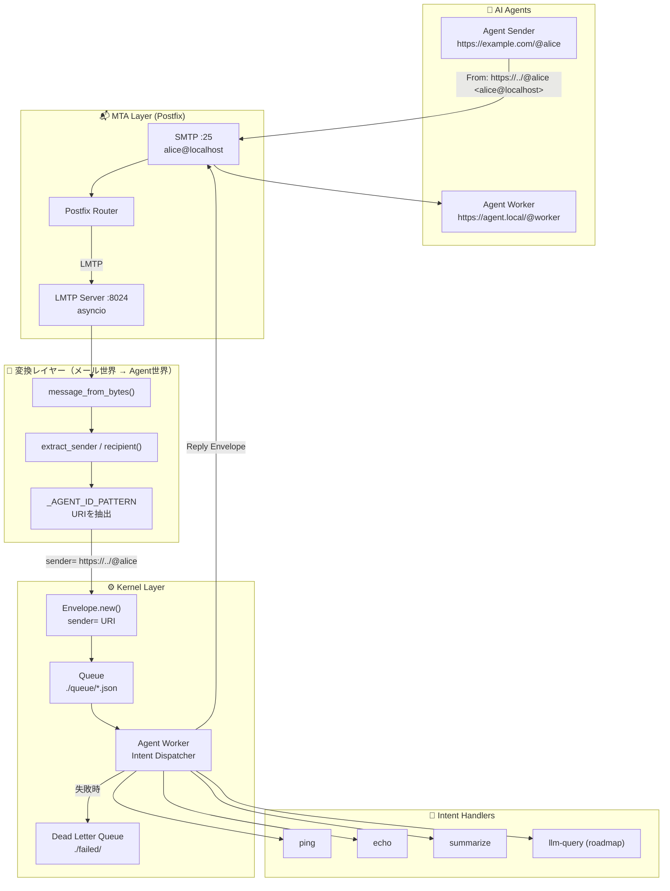

# AI Agent Hub
### 分散型AIエージェントのための、MTAベースOSレイヤー

[](https://opensource.org/licenses/MIT)
[](#アーキテクチャ)
[](https://www.python.org/)

---

## ビジョン：24時間稼働の「インテリジェント・ニュースルーム」

あなたが眠っている間も、100体のAIエージェントが静かに、休まず動き続ける——そんな世界を想像してください。

世界中のRSSフィード、SNS、ニュースメールが流れ込む。`grep`と`jq`で機械的に高速フィルタリングされ、本当に重要なものだけがLLMに届く。要約はNotion、WordPress、あるいは特定のクライアントへ——自動的に、確実に、1件のロスもなく配信される。

**AI Agent Hubは、そのために作られています。**

チャットボットではありません。実験台でもありません。**24時間365日稼働し、障害に耐え、証拠を残す——ミッションクリティカルなAIエージェント基盤**です。

---

## なぜ重要か：インフラグレードAIの三本柱

### ① 衝撃吸収材 — 再送・遅延耐性

従来のWebシステムは「今すぐ返せ、さもなくば死ね」という世界です。REST APIは静かに失敗し、キューは後付けで継ぎ足される。

AI Agent Hubは設計思想から違います。MTAレイヤーが**構造的に衝撃を吸収します**：

- **Thundering Herd（落雷現象）の回避**：朝8時に1,000通のニュースメールが届いても、MTAが自動でトラフィックを制御——LLMのレート制限に合わせて100通ずつ流します。カスタムのスロットリングコードは一切不要。
- **バックオフの自動化**：WordPressがメンテナンス中なら、Postfixが「4時間後に再送」と自動スケジュール。Workerに複雑な`try/catch`リトライループを書く必要はありません。プロトコルが処理します。

> *「エージェントはオフラインになれる。メッセージはなれない。」*

### ② 編集長の目 — 監査とトレーサビリティ

AIを本番環境に投入する最大の不安：*「なぜこうなったか分からない」*。

AI Agent Hubはこれを**プロトコルレベルの不変ログ**で解決します：

- ソースメール → フィルタ通過後のテキスト → LLMへのプロンプト → 生の回答 → Notion投稿コマンド——全工程が`thread_id`で連鎖するEnvelopeとして物理的に保存されます。
- 「要約がおかしい」となったとき、1つのEnvelopeスレッドを開けば「どのエージェントが、どの瞬間にトチったか」が秒で分かります。5つのサービスにまたがるログをgrepする必要はありません。
- これは分散AIパイプラインにおける**スタックトレース**です。

### ③ ポリシーゲートウェイ — ガバナンスとコントロール

100体のAIを野放しにしない。AI Agent Hubはルールをインフラ層で強制します：

- **コンテンツフィルタリング**：MilterベースのサニタイザーエージェントがPIIを除去し、不適切なコンテンツをLLMに届く前にブロック——アプリケーションコードには一切手を触れずに。
- **Human-in-the-Loop**：重要度「高」のアイテムは承認メールをあなたに送信。あなたが「OK」と返信したときだけ後続のWorkerが動く。カスタムオーケストレーションロジックはゼロ。

---

## アーキテクチャ



---

## コアコンセプト

### Envelopeモデル

AI Agent Hubにおける全ての通信は**Envelope**——構造化された不変の作業単位——に封入されます。

```json
{
  "id": "uuid-v4",
  "sender": "https://example.com/@researcher",
  "recipient": "https://agent.local/@executor",
  "envelope_type": "TASK_EXECUTION",
  "payload": {
    "intent": "summarize",
    "text": "最近のPRからビジネスインサイトを抽出してください"
  },
  "context": {
    "thread_id": "tx_9987",
    "in_reply_to": "uuid-v3",
    "priority": "high"
  },
  "created_at": "2026-02-18T23:00:00Z"
}
```

全てのAI間会話は`thread_id`でスレッド化され、マルチエージェントパイプライン全体のトレーサビリティを確保します。

### 変換レイヤー：SMTP ↔ Agent世界

AI Agent Hubは2つの世界を橋渡しします：

| レイヤー | IDフォーマット |
|---------|--------------|
| SMTP（トランスポート） | `alice@localhost` |
| Envelope（エージェント） | `https://example.com/@alice` |

`_AGENT_ID_PATTERN`正規表現がメールヘッダからURIを抽出し、**メールインフラとエージェントセマンティクスの変換レイヤー**として機能します。これは回避策ではなく、設計そのものです。

### プロトコルをインターフェースとして

SMTP/LMTPを抽象化レイヤーとすることで、AI Agent Hubは：
- **言語非依存**：SMTPを話せるプロセスなら何でも参加できる
- **プラットフォーム非依存**：Linux、クラウド、オンプレ——Postfixが動く場所ならエージェントも動く
- **運用互換**：標準のメール監視ツール（`mailq`、`postqueue`）がそのまま使える

---

## パイプラインフロー

```
1. Submission  → Agent が Envelope（JSON）を SMTP 経由で送信
2. Routing     → Postfix が宛先に基づきルーティング、LMTP 経由で配送
3. Parsing     → LMTP Handler が MIME をデコード、Agent URI を抽出
4. Persistence → Envelope をキューディレクトリにアトミックに保存
5. Execution   → Agent Worker が intent をピックアップし、ハンドラまたは LLM スキルを実行
6. Reply       → 結果を Envelope として再封入し、SMTP 経由で返信
```

---

## クイックスタート

```bash
# クローンとインストール
git clone https://github.com/raberabe1121/ai-agent-os.git
cd ai-agent-os
pip install -e .

# LMTPサーバーを起動
python -m ai_agent_hub.lmtp_server

# 別ターミナルでWorkerを起動
python -m ai_agent_hub.agent_worker

# 最初のEnvelopeを送信
python -c "
from ai_agent_hub import Envelope
from ai_agent_hub.smtp_sender import send_envelope_via_smtp

env = Envelope.new(
    envelope_type='TASK',
    sender='https://myapp.local/@orchestrator',
    recipient='https://myapp.local/@worker',
    payload={'intent': 'ping'}
)
send_envelope_via_smtp(env)
print('Envelope sent:', env.id)
"
```

---

## ユースケース

### インテリジェント・ニュースルーム（リファレンスアーキテクチャ）

```
RSS / SNS / ニュースメール
        ↓
CollectorAgent        ← 監視・収集
        ↓ Envelope
FilterAgent           ← grep / jq で高速フィルタリング（LLM不使用）
        ↓ 通過したものだけ
SummarizerAgent × N   ← LLMで要約（重い処理はここだけ）
        ↓ Envelope
DistributorAgent      ← Notion / WordPress / メール配信
```

**コスト設計のポイント**：LLMが呼ばれるのはCLIフィルタリングを通過したものだけ。90%のアイテムは高コストなステップに到達しません。

### 競合調査レポートボット（収益化シナリオ）

| 顧客の不安 | Hubの回答 |
|-----------|----------|
| 「AIが嘘をついたり、機密情報を漏らしたら？」 | 全ペイロードはサニタイザーエージェントを通過。PIIはLLMが見る前に除去され、全判断はログに残ります。 |
| 「システムが止まったら？」 | Postfixがキューを保持します。障害中もメッセージは1件も消えません。 |
| 「何が起きたか後から確認できるか？」 | Envelopeスレッドを開けば、全ステップがそこにあります。 |

---

## ロードマップ

| フェーズ | 機能 | ステータス |
|---------|------|----------|
| v0.2 | LMTPサーバー、Envelopeモデル、Agent Worker、SMTP返信 | ✅ 完了 |
| v0.3 | `llm-query` intent、CLIスキル（gh-cli、jq）、SQLite永続化 | 🔨 開発中 |
| v0.4 | Dead Letter Queue、inotifyベースWorker、並列処理 | 📋 計画中 |
| v1.0 | ActivityPubフェデレーション、セキュリティレイヤー（PIIフィルタリング）、サーバーレススケーリング | 🔭 構想中 |

---

## 作者について

2019年より、日本およびベトナムにてMTA（C/PHP）を用いた大規模メールセキュリティ製品の設計・実装・運用を一貫して担当するシニアソフトウェアエンジニア。

> *「枯れた技術を最新のパラダイムで再定義する」*

インフラレベルの視座から、AIエージェントが真に「社会のインフラ」となるための高信頼なメッセージング基盤を追求しています。

---

## ライセンス

MIT — 詳細は [LICENSE](LICENSE) を参照してください。
