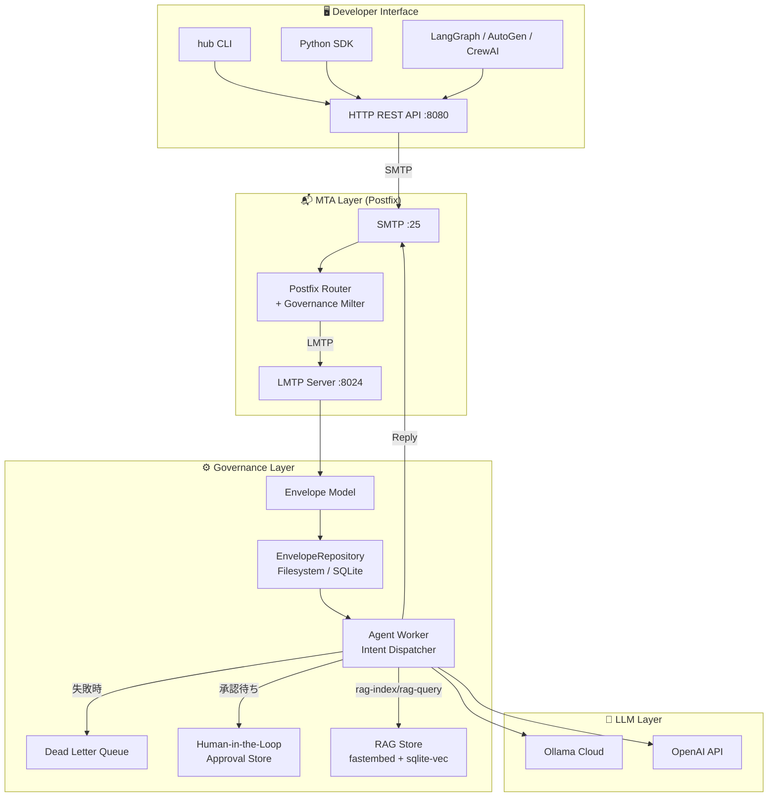

# AI Agent Hub

### Governance Messaging Layer for AI Agents

#### v0.6 | "The SMTP for the Agentic Era."

[](https://opensource.org/licenses/MIT)
[](#技術アーキテクチャ)
[](https://www.python.org/)
[](#ロードマップ)

> AIエージェントの通信・監査・ガバナンスを担う、SMTP/MIMEベースのメッセージング基盤。

---

## これは何か

**AI Agent Hubは：**

- ✅ AIエージェント間の**非同期メッセージング基盤**
- ✅ 全通信を追跡可能なログとして残す**監査レイヤー**
- ✅ ポリシー・承認フロー・予算制御を担う**ガバナンスレイヤー**
- ✅ 既存のメールインフラ（Postfix）と統合可能な**配送保証レイヤー**
- ✅ fastembed + sqlite-vecによる**軽量RAG（知識ベース検索）**

---

## 誰のためのプロジェクトか

**主なターゲット：エンタープライズのAI導入担当者・セキュリティ担当者**

AIを業務に導入する際の最大の障壁は「知能の欠如」ではなく**「ガバナンスの不在」**です。

- 「AIが勝手に何をしたか分からない」→ **監査ログで全工程を追跡可能**
- 「AIの判断を誰が承認したか不明」→ **Human-in-the-loopで承認フローを強制**
- 「AIが予算を超えて動いたら困る」→ **X-Agent-Cost-Centerで予算制御**
- 「機密情報がAIを経由して外部に漏れないか」→ **X-Agent-Policyで配送レイヤーで遮断**
- 「エージェントに社内知識を持たせたい」→ **RAGで知識ベースを構築・検索**

**二次ターゲット：マルチエージェントシステムの研究者・開発者**

LangGraph/AutoGen/CrewAIと組み合わせて、エージェント間通信に監査性とガバナンスを追加したい場合。

---

## 5分で動かす

### systemd方式

```bash
git clone https://github.com/raberabe1121/ai-agent-os.git
cd ai-agent-os
pip install -e .

# 各サービスを起動
python -m ai_agent_hub.lmtp_server &
python -m ai_agent_hub.agent_worker &
python -m ai_agent_hub.api_server &

# CLIで動作確認
hub status
hub send --intent ping
hub send --intent llm-query --text "今日の横浜の天気は？"
hub logs
```

```
AI Agent Hub ステータス
  API Server:   ✅ http://localhost:8080
  Queue Dir:    ✅ /opt/ai-agent-hub/queue
  Processed:    ✅ /opt/ai-agent-hub/processed

→ Envelope送信: e670bfe0-b0ce-4c4b-81a4-1337bbe7695d
← 返信受信:
   {"result": "今日の横浜の天気は晴れ時々くもりで、最高気温は28℃..."}
```

### Docker Compose方式

```bash
git clone https://github.com/raberabe1121/ai-agent-os
cd ai-agent-os
cp .env.example .env  # OLLAMA_API_KEYを設定
docker compose up -d
```

---

## 理論的基盤：「エラーの共鳴」を断ち切る

> **注記：** 以下はコンセプト段階の理論的アプローチです。実験的評価・論文は未公開です。

### 統計的同調バイアスの排除

同じ学習データを持つAI同士を戦わせても、エラーの相関（共分散）$\text{Cov}(X_i, X_j) > 0$ により、システム全体の分散は二次関数的に爆発し、**「集団催眠的なハルシネーション」**に陥ります。

$$\text{Var}\left(\sum_{i=1}^{n} X_i\right) = \sum_{i=1}^{n} \text{Var}(X_i) + \sum_{i \neq j} \text{Cov}(X_i, X_j)$$

### エントロピー・インジェクション（実験的機能）

Hubはメッセージの類似度を監視し、多様性が失われた瞬間に外部コンテキストを注入して推論の枝を分岐させます。現時点では実験的な実装であり、効果の定量評価は今後の課題です。

```bash
hub send --intent entropy-check \
  --text '{"thread_id": "tx_001", "messages": ["same", "same", "same"]}'
# → {"entropy": 0.0, "is_low": true, "injected_context": "Consider an alternative..."}
```

---

## 開発者体験：3つのインターフェース

### 🖥️ CLI（`hub`コマンド）

```bash
# Envelopeを送信して返信を待つ
hub send --intent ping
hub send --intent llm-query --text "今日の天気は？" --model gemma3:4b
hub send --intent summarize --text "長いテキスト..."

# ログ・状態確認
hub logs
hub logs --limit 10
hub logs --intent llm-query
hub status
hub intents

# Human-in-the-loop
hub pending
hub approve <approval-id>
hub reject <approval-id> --reason "予算超過"

# RAG（知識ベース検索）
hub rag-index --text "ドキュメントの内容" --source "出典名"
hub rag-index --file path/to/doc.txt --source "ファイル名"
hub rag-query --query "質問内容"
hub rag-query --query "質問内容" --limit 3 --no-llm
```

### 🌐 HTTP REST API

```bash
# Envelopeを送信
curl -X POST http://localhost:8080/envelopes \
  -H "Content-Type: application/json" \
  -d '{"intent": "llm-query", "text": "こんにちは"}'

# 返信を取得（30秒ポーリング）
curl http://localhost:8080/envelopes/{id}/reply

# ログ確認
curl "http://localhost:8080/logs?limit=10&intent=llm-query"

# 承認管理
curl http://localhost:8080/approvals/pending
curl -X POST http://localhost:8080/approvals/{id}/approve

# RAG
curl -X POST http://localhost:8080/rag/index \
  -H "Content-Type: application/json" \
  -d '{"text": "ドキュメントの内容", "source": "出典名"}'

curl -X POST http://localhost:8080/rag/query \
  -H "Content-Type: application/json" \
  -d '{"query": "質問内容", "limit": 5, "use_llm": true}'

# ヘルスチェック
curl http://localhost:8080/health
```

### 🐍 Python SDK

```python
from ai_agent_hub.sdk import AgentHub

hub = AgentHub()  # AI_AGENT_HUB_URL または http://localhost:8080

# シンプルな送信
result = hub.send(intent="llm-query", text="今日の天気は？")
print(result.payload)  # {"result": "晴れ時々くもり..."}

# 承認フロー
approval = hub.request_approval(
    description="経費申請 ¥150,000",
    approver="https://company.local/@manager",
    callback={"intent": "echo", "text": "承認されました"},
)
hub.approve(approval.approval_id)

# ログ確認
logs = hub.logs(limit=5, intent="llm-query")
for log in logs:
    print(f"{log.time} | {log.intent} | {log.payload}")
```

詳細は [examples/quickstart.py](https://github.com/raberabe1121/ai-agent-os/blob/main/examples/quickstart.py) を参照してください。

API仕様の詳細は [AI Agent Hub Python SDK — APIリファレンス](https://github.com/raberabe1121/ai-agent-os/blob/main/docs/python-sdk-api-reference.md) を参照してください。

---

## RAG（知識ベース検索）

### アーキテクチャ

外部サービス不要の完全自己完結型RAGを内蔵しています。

```
テキスト入力
    ↓
fastembed（paraphrase-multilingual-MiniLM-L12-v2）
    ↓ 384次元ベクトルに変換（50言語対応・日本語含む）
sqlite-vec（SQLite拡張 vec0仮想テーブル）
    ↓ KNN検索（コサイン距離）
distance閾値でフィルタ（--max-distance）
    ↓ use_llm=trueの場合
Ollama Cloud（gemma3:4b等）
    ↓ 関連ドキュメントのみをコンテキストとして回答生成
回答を返す
```

### 技術スタック

| 項目 | 内容 |
| --- | --- |
| Embeddingライブラリ | [fastembed](https://github.com/qdrant/fastembed) v0.8.0 |
| Embeddingモデル | `sentence-transformers/paraphrase-multilingual-MiniLM-L12-v2`（384次元、~250MB、50言語対応） |
| ベクトルDB | [sqlite-vec](https://github.com/asg017/sqlite-vec) v0.1.9（SQLite拡張） |
| 距離関数 | コサイン距離（vec0仮想テーブル） |
| ストレージ | 既存の`agent_hub.db`に統合（追加DBファイル不要） |
| メモリ使用量 | Embeddingモデル ~250MB（950MB RAM環境で動作確認済み） |

### 設計上の選択理由

**なぜfastembedか**
- `pip install fastembed`だけで完結。ONNXランタイム内蔵のため追加サービス不要
- Ollama Cloud embed APIが利用不可だったため（`unauthorized`エラー）、ローカル完結を選択

**なぜparaphrase-multilingual-MiniLM-L12-v2か**
- Microsoft MiniLMアーキテクチャをベースに50言語で学習した多言語対応モデル
- 英語特化モデル（`bge-small-en`）では日本語の意味的類似度が正しく計算されなかった（無関係な文が1位になるケースが発生）
- このモデルに変更後、「承認フローについて教えて」→「Human-in-the-loopで承認フローを強制できます」が正しく1位になることを確認済み

**なぜsqlite-vecか**
- 既存の`agent_hub.db`（SQLite）に`vec0`仮想テーブルを追加するだけで導入可能
- ChromaDB・Qdrantと違い、追加プロセスやポートが不要
- 950MB RAM制約のOCI環境でも安定動作

### 使い方

```bash
# ドキュメントを登録
hub rag-index --text "AI Agent HubはSMTPベースのガバナンスレイヤーです" --source "readme"
hub rag-index --file ./docs/policy.txt --source "policy"

# 検索 + LLMによる回答生成（デフォルト）
hub rag-query --query "承認フローについて教えて"
# → {
#     "answer": "Human-in-the-loopで承認フローを強制できます...",
#     "sources": [{"content": "...", "source": "readme", "distance": 3.02}],
#     "query": "承認フローについて教えて"
#   }

# distance閾値で無関係なドキュメントを除外（推奨）
# distanceが小さいほど意味的に近い。閾値以上のドキュメントはLLMに渡さない
hub rag-query --query "承認フローについて教えて" --max-distance 3.5
# → 承認フロー関連のドキュメントのみでLLMが回答を生成

# 検索結果のみ（LLMなし・高速）
hub rag-query --query "承認フローについて" --limit 3 --no-llm
# → {
#     "sources": [{"content": "...", "source": "readme", "distance": 3.02}],
#     "query": "承認フローについて"
#   }
```

### --max-distanceの目安

distanceはコサイン距離で、値が小さいほど意味的に近いドキュメントです。

| distance | 意味 |
| --- | --- |
| 0〜2.0 | 非常に近い（ほぼ同じ意味） |
| 2.0〜3.5 | 関連あり |
| 3.5〜5.0 | やや遠い（関連が薄い） |
| 5.0以上 | ほぼ無関係 |

`--max-distance 3.5`を基本として、ドメインに合わせて調整してください。

### REST API

```bash
# インデックス登録
curl -X POST http://localhost:8080/rag/index \
  -H "Content-Type: application/json" \
  -d '{"text": "ドキュメントの内容", "source": "出典名"}'
# → {"status": "indexed", "doc_id": 1, "source": "出典名"}

# 検索（max_distanceで足切り）
curl -X POST http://localhost:8080/rag/query \
  -H "Content-Type: application/json" \
  -d '{"query": "質問内容", "limit": 5, "use_llm": true, "max_distance": 3.5}'
```

---

## セキュリティ・ポリシーの実例

### X-Agent-Policy による機密情報遮断

```python
# 組織外への機密情報送信を配送レイヤーで遮断
env = Envelope.new(
    sender="https://company.local/@agent",
    recipient="https://external.com/@partner",  # 組織外
    payload={"text": "secret_key=abc123"},
    headers={"X-Agent-Policy": "confidential=block"},
)
# → Governance Milterが配送を拒否
# → 550 Policy violation: confidential content blocked
```

### X-Agent-Cost-Center による予算・レート制限

```python
env = Envelope.new(
    payload={"intent": "llm-query", "text": "分析してください"},
    headers={
        "X-Agent-Cost-Center": "dept=engineering; budget=100USD/day; rate-limit=100/hour",
    },
)
# → 予算上限超過時はDLQに移動してアラート
```

### X-Agent-Workflow による承認強制

```python
env = Envelope.new(
    payload={"intent": "cli-skill", "skill": "gh", "args": ["pr", "create"]},
    headers={"X-Agent-Workflow": "spec-approval-required=true"},
)
# → spec_approvedフラグがなければ配送を拒否
```

> **監査ログについての注記：** 現在の実装はファイルシステム・SQLiteへの追記で記録します。これは追跡可能性を提供しますが、root権限による改ざんは防げません。真の改ざん困難性にはWORMストレージ・CloudTrail等との統合が必要であり、Phase 3で対応予定です。

---

## 5つのガバナンス機能（実証済みデモ）

`demo_expense_approval.py`で動作確認済みです。

### ① 横断的なエージェント管理

複数のエージェントがEnvelopeを介して連携します。各エージェントは役割を持ち、順番に処理を引き継ぎます。

```
RequestAgent → PolicyAgent → HumanApprovalAgent → ExecutionAgent
```

### ② 権限・ポリシー制御

X-Agent-Policyヘッダーで承認ルールを定義します。金額や条件に応じて自動的にポリシーを適用し、Human-in-the-loopによる承認を強制できます。

```
X-Agent-Policy: human-approval-required=true; amount-jpy=150000
→ 10万円超えを自動検知してポリシーを適用
```

### ③ 監査・因果トレース

```bash
hub logs
```

```
05:24:49 | submit-expense    | RequestAgent → PolicyAgent   | ✅ ¥150,000申請
05:24:50 | request-approval  | PolicyAgent → Worker         | ✅ 承認待ち
14:44:58 | approve           | HumanAgent → Worker          | ✅ 承認
```

### ④ Human-in-the-loop

承認フローを人間が制御します。承認待ち一覧を確認し、承認または却下できます。`hub pending`で承認待ちのEnvelopeを一覧表示し、`hub approve`または`hub reject`で承認・却下します。

```bash
hub pending
# → 承認待ち: 1件 [7698e25a] 海外出張経費 ¥150,000

hub approve 7698e25a
# → callback_payloadが自動実行されました
```

### ⑤ 長期状態管理・DLQ・リトライ

処理に失敗したEnvelopeはDead Letter Queueに移動し、リトライされます。PostfixがMTAとしてキューを保持するため、システムダウン中もメッセージは消えません。

```
処理失敗 → DLQ移動 → リトライ → 成功
Postfixがキューを保持するため、システムダウン中もメッセージは消えない
```

---

## エコシステム連携

### LangGraph との連携

```python
from langgraph.graph import StateGraph
import httpx

def envelope_node(state):
    r = httpx.post(
        "http://localhost:8080/envelopes",
        json={"intent": "llm-query", "text": state["input"]},
    )
    envelope_id = r.json()["envelope_id"]
    reply = httpx.get(f"http://localhost:8080/envelopes/{envelope_id}/reply")
    return {"output": reply.json()["payload"]["result"]}

graph = StateGraph(dict)
graph.add_node("governed_analysis", envelope_node)
```

### CrewAI との連携

```python
from crewai.tools import tool
import httpx

@tool("envelope_hub_tool")
def send_to_hub(intent: str, text: str) -> str:
    """ガバナンス付きでAI Agent Hubにタスクを送信する"""
    r = httpx.post(
        "http://localhost:8080/envelopes",
        json={"intent": intent, "text": text},
    )
    envelope_id = r.json()["envelope_id"]
    reply = httpx.get(f"http://localhost:8080/envelopes/{envelope_id}/reply")
    return str(reply.json()["payload"])
```

---

## 技術アーキテクチャ



---

## 対応LLMプロバイダー

| プロバイダー | 設定 | モデル例 |
| --- | --- | --- |
| Ollama Cloud（デフォルト） | `LLM_PROVIDER=ollama` | `gemma3:4b`, `ministral-3:3b` |
| OpenAI | `LLM_PROVIDER=openai` | `gpt-4o-mini` |

---

## ロードマップ

| バージョン | 主な機能 | 状態 |
| --- | --- | --- |
| **v0.5** | CLI・REST API・Python SDK・Ollama連携・Human-in-the-loop | ✅ |
| **v0.6（現在）** | Docker Compose・RAG（fastembed + sqlite-vec）・SDK APIリファレンス | ✅ |
| **v0.7** | LangGraph / AutoGen / CrewAI ブリッジ正式対応 | 📋 計画中 |
| **v1.0** | AWS Serverless・KMS/CloudTrail統合・Enterprise対応 | 🔭 将来 |

### 実装済み機能

- ✅ LMTP Server（asyncio）・Envelope Model・Agent Worker
- ✅ Dead Letter Queue・リトライ・長期状態管理
- ✅ `llm-query` intent（Ollama Cloud / OpenAI）
- ✅ EnvelopeRepository（Filesystem / SQLite）
- ✅ Governance Milter（X-Agent-Policy / X-Agent-Cost-Center）
- ✅ Circle/USDC Payment Gateway（dryrun）
- ✅ Consensus Entropy Monitor（実験的）
- ✅ CLI Skills（curl / grep / jq / gh）
- ✅ Human-in-the-Loop（承認フロー）
- ✅ HTTP REST API（FastAPI）
- ✅ CLIツール（`hub`コマンド）
- ✅ Python SDK（`AgentHub`クラス）
- ✅ Docker Compose対応
- ✅ RAG（rag-index / rag-query、fastembed + sqlite-vec）

---

## ライセンス

MIT — 詳細は [LICENSE](https://github.com/raberabe1121/ai-agent-os/blob/main/LICENSE) を参照してください。
