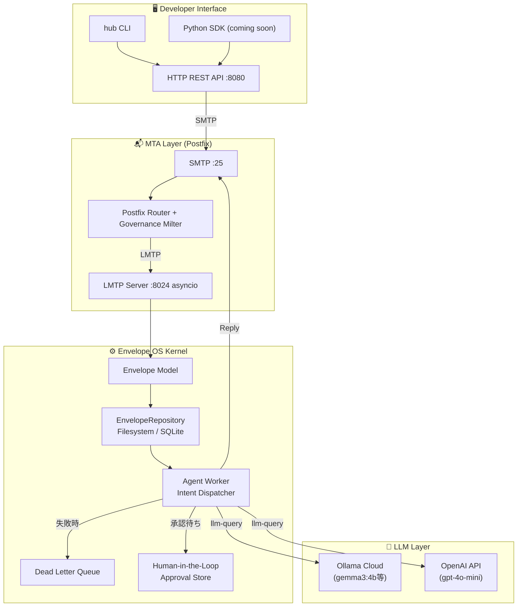

# AI Agent Hub — Envelope OS
### v0.5 | "The SMTP for the Agentic Era."

[](https://opensource.org/licenses/MIT)
[](#技術アーキテクチャ)
[](https://www.python.org/)
[](#ロードマップ)

> AI知能（Brain）と社会（Reality）を繋ぐ、エージェント専用の分散型ガバナンス・メッセージングOS。

---

## 5分で動かす

```bash
git clone https://github.com/raberabe1121/ai-agent-os.git
cd ai-agent-os
pip install -e .

# LMTPサーバーとWorkerをsystemdで起動（または直接）
python -m ai_agent_hub.lmtp_server &
python -m ai_agent_hub.agent_worker &
python -m ai_agent_hub.api_server &

# CLIで確認
hub status
hub send --intent ping
hub send --intent llm-query --text "今日の横浜の天気は？"
hub logs
```

```
AI Agent Hub ステータス
  API Server:   ✅ http://localhost:8080
  Queue Dir:    ✅ /opt/ai-agent-hub/queue
  Processed:    ✅ /opt/ai-agent-hub/processed

→ Envelope送信: 3e6abebf-9809-4560-b509-d877cad0eca9
← 返信受信:
   {"pong": true}

→ Envelope送信: e670bfe0-b0ce-4c4b-81a4-1337bbe7695d
← 返信受信:
   {"result": "今日の横浜の天気は晴れ時々曇りで、最高気温は26℃..."}
```

---

## プロジェクトビジョン：Governance over Intelligence

2026年、AIエージェントは単なる「チャットボット」から「自律的な労働力」へと進化しました。しかし、企業導入における最大の障壁は**「知能の欠如」ではなく「ガバナンスの不在」**です。

AI Agent Hub（Envelope OS）は、SMTP/MIMEプロトコルを基盤に、AIエージェントの挙動を「物理的」かつ「数理的」に制御するレイヤーを提供します。知能（LLM）の外側に**物理的な規律（Policy）と不変の記録（Audit）**を配置することで、エージェントを社会に実装可能な「責任ある資産」へと変革します。

---

## 理論的基盤：「エラーの共鳴」を断ち切る

### 1. 統計的同調バイアスの排除

同じ学習データを持つAI同士を戦わせても、エラーの相関（共分散）$\text{Cov}(X_i, X_j) > 0$ により、システム全体の分散は二次関数的に爆発し、**「集団催眠的なハルシネーション」**に陥ります。

$$\text{Var}\left(\sum_{i=1}^{n} X_i\right) = \sum_{i=1}^{n} \text{Var}(X_i) + \sum_{i \neq j} \text{Cov}(X_i, X_j)$$

### 2. エントロピー・インジェクション

Hubはメッセージの類似度を監視し、多様性が失われた（エントロピーが低下した）瞬間に、外部の確定情報（Ground Truth）や逆説的なコンテキストを強制注入し、推論の枝を物理的に分岐させます。

---

## 開発者体験：3つのインターフェース

### 🖥️ CLI（`hub`コマンド）

```bash
# Envelopeを送信して返信を待つ
hub send --intent ping
hub send --intent llm-query --text "今日の天気は？"
hub send --intent summarize --text "長いテキスト..."

# ログ・状態確認
hub logs
hub logs --limit 10
hub status

# Human-in-the-loop
hub pending
hub approve <approval-id>
hub reject <approval-id> --reason "予算超過"

# intent一覧
hub intents
```

### 🌐 HTTP REST API

```bash
# Envelopeを送信
curl -X POST http://localhost:8080/envelopes \
  -H "Content-Type: application/json" \
  -d '{"intent": "llm-query", "text": "こんにちは"}'

# 返信を取得
curl http://localhost:8080/envelopes/{id}/reply

# ログ確認
curl http://localhost:8080/logs?limit=10

# 承認管理
curl http://localhost:8080/approvals/pending
curl -X POST http://localhost:8080/approvals/{id}/approve

# ヘルスチェック
curl http://localhost:8080/health
```

### 🐍 Python SDK（Coming Soon）

```python
from ai_agent_hub import AgentHub

hub = AgentHub(base_url="http://localhost:8080")
result = hub.send(intent="llm-query", text="今日の天気は？")
print(result.payload)
```

---

## 5つのガバナンス機能（実証済みデモ）

以下は`demo_expense_approval.py`で実際に動作確認済みの機能です。

### ① 横断的なエージェント管理

```
RequestAgent → PolicyAgent → HumanApprovalAgent → ExecutionAgent
```

4つのエージェントが連携して1つのフローを処理します。

### ② 権限・ポリシー制御

```
X-Agent-Policy: human-approval-required=true; amount-jpy=150000
→ 10万円超えを自動検知してガバナンスポリシーを適用
```

### ③ 監査・因果トレース

```bash
hub logs --thread-id expense-demo-xxx
```

```
13:58:33 | submit-expense    | RequestAgent → PolicyAgent    | ✅ ¥150,000申請
13:58:33 | policy-decision   | PolicyAgent → ApprovalAgent   | ✅ 人間承認必須
13:58:33 | request-approval  | PolicyAgent → Worker          | ✅ 承認待ち
14:44:58 | approve           | HumanAgent → Worker           | ✅ 承認
14:44:59 | echo              | Manager → PolicyAgent         | ✅ 承認済み
```

### ④ Human-in-the-loop

```bash
hub pending
# → 承認待ち: 1件 [7698e25a] 海外出張経費 ¥150,000

hub approve 7698e25a-306f-4f10-bb61-0d9976746a75
# → callback_payloadが自動実行されました
```

### ⑤ 長期状態管理・DLQ・リトライ

```
処理失敗 → DLQ移動 → リトライ → 成功
Postfixがキューを保持するため、システムダウン中もメッセージは消えない
```

---

## 主要機能：2026 Standard

### 📩 MIME-Based Agent Messaging

JSON APIではなく、SMTP/MIMEを採用。

- **Auditability**：配送された「封筒（Envelope）」そのものが改ざん不能な証拠として残る
- **Interoperability**：既存のメールインフラと無改造で統合可能

### 🛡️ AI Governance Stack（AIGS）Compliance

```
X-Agent-Policy: confidential=block, pii=mask
X-Agent-Workflow: spec-approval-required=true
X-Agent-Cost-Center: dept=engineering, budget=100USD/day
```

### 💰 Programmable Economy（Circle Integration）

```
X-Agent-Payment-Required: amount=0.10USDC, recipient=agent.local/@executor
```

メール1通で「業務依頼・決済・領収書発行」を完結させます。

### 🧠 Consensus Entropy Monitor

```python
hub send --intent entropy-check \
  --text '{"thread_id": "tx_001", "messages": ["same", "same", "same"]}'
# → {"entropy": 0.0, "is_low": true, "injected_context": "Consider an alternative..."}
```

### 🔧 CLI Skills

```bash
hub send --intent cli-skill --text '{"skill": "curl", "args": ["-s", "https://..."]}'
hub send --intent cli-pipeline --text '{"steps": [{"skill": "grep", ...}, {"skill": "jq", ...}]}'
```

---

## 技術アーキテクチャ



---

## Envelope Model

```json
{
  "id": "uuid-v4",
  "from": "https://company.local/@policy-agent",
  "to": "https://agent.local/@worker",
  "type": "command",
  "payload": {
    "intent": "request-approval",
    "description": "海外出張経費 ¥150,000の承認申請",
    "approver": "https://company.local/@manager"
  },
  "context": "expense-thread-001",
  "inReplyTo": null,
  "time": "2026-04-06T05:24:50Z",
  "version": "v0.1"
}
```

---

## 対応LLMプロバイダー

| プロバイダー | 設定 | モデル例 |
|------------|------|---------|
| Ollama Cloud（デフォルト） | `LLM_PROVIDER=ollama` | `gemma3:4b`, `ministral-3:3b` |
| OpenAI | `LLM_PROVIDER=openai` | `gpt-4o-mini` |

```bash
export LLM_PROVIDER=ollama
export OLLAMA_API_KEY=your_key
hub send --intent llm-query --text "こんにちは" --model gemma3:4b
```

---

## ロードマップ

| Phase | Architecture | Focus | 状態 |
|-------|-------------|-------|------|
| **Phase 1（現在）** | Python / Linux / Postfix | Core Logic & Protocol | ✅ 完了 |
| **Phase 2（移行）** | AWS Serverless Stack | Scalability & HA（99.99%） | 📋 計画中 |
| **Phase 3（Enterprise）** | KMS / CloudTrail Integration | Immutable Audit & Compliance | 🔭 将来 |

### Phase 1 実装済み機能

- ✅ LMTP Server（asyncio）
- ✅ Envelope Model + Agent Worker
- ✅ Dead Letter Queue + リトライ
- ✅ `llm-query` intent（Ollama Cloud / OpenAI）
- ✅ EnvelopeRepository（Filesystem / SQLite）
- ✅ Governance Milter（AIGS Compliance）
- ✅ Circle/USDC Payment Gateway（dryrun）
- ✅ Consensus Entropy Monitor
- ✅ CLI Skills（curl / grep / jq / gh）
- ✅ Human-in-the-Loop（承認フロー）
- ✅ HTTP REST API（FastAPI）
- ✅ CLIツール（`hub`コマンド）
- 📋 Python SDK
- 📋 Docker Compose
- 📋 LangChain / CrewAI ブリッジ

---

## 作者について

2019年より、日本およびベトナムにてMTA（C/PHP）を用いた大規模メールセキュリティ製品の設計・実装・運用を一貫して担当するシニアソフトウェアエンジニア。

> *「盤石な技術を最新のパラダイムで再定義する。知能（LLM）の外側に、物理的な規律と不変の記録を置く。」*

---

## ライセンス

MIT — 詳細は [LICENSE](LICENSE) を参照してください。
