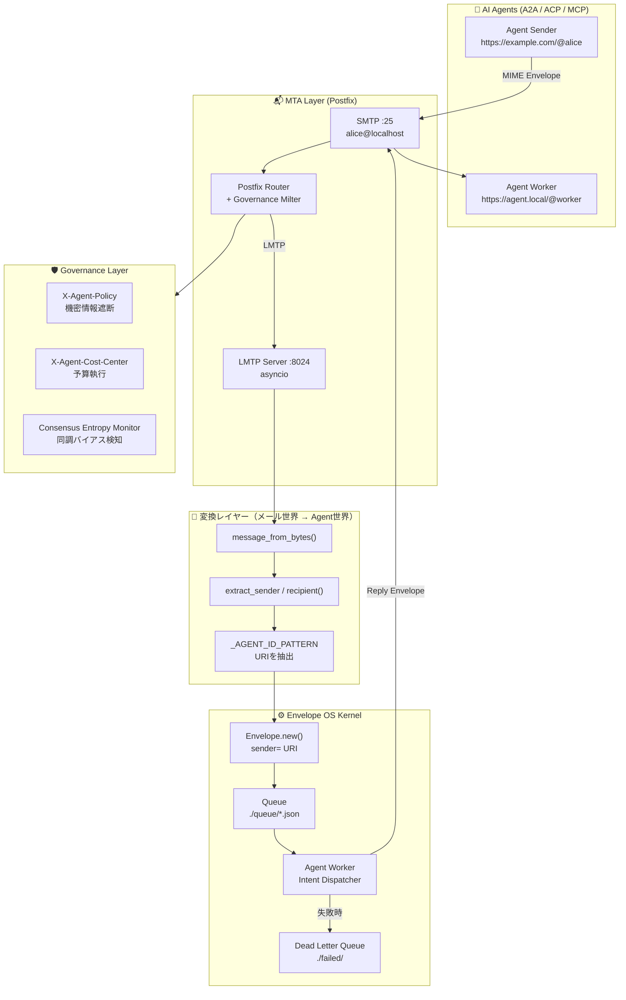

# AI Agent Hub — Envelope OS
### v0.4 | "The SMTP for the Agentic Era."

[](https://opensource.org/licenses/MIT)
[](#アーキテクチャ)
[](https://www.python.org/)
[](#roadmap)

> AI知能（Brain）と社会（Reality）を繋ぐ、エージェント専用のガバナンス・メッセージングOS。

---

## 概要

AI Agent Hub（Envelope OS）は、SMTP/MIMEプロトコルを基盤とした、自律型AIエージェントのための**「配送・統制レイヤー」**です。

2026年、AIの知能は飛躍的に向上しましたが、エージェント間の**「情報の過多による知能低下」「経済的暴走」「集団催眠的なハルシネーション」**といった課題が浮き彫りになっています。

本プロジェクトは、知能（LLM）の外側に**物理的な規律（Policy）と不変の記録（Audit）**を配置することで、AIエージェントを社会に実装可能な「責任ある労働力」へと変革します。

---

## Governance over Intelligence：3つの物理的制約

どれだけAIが賢くなっても、知能の内部に閉じ込められない**「3つの物理的制約」**をHubが担います。

### ① 物理的証拠（Evidence）
AIの自己申告ではなく、配送された**「封筒（MIME）」そのものを改ざん不能な証拠**として残す。

「どのエージェントが、どのコマンドを発行し、その時どんなLLMがどう考えたか」——この全工程が`thread_id`で連鎖するEnvelopeとして物理的に保存されます。企業がAI導入で直面する最大の障壁「ブラックボックス化」を、MTAという30年の実績を持つ透明性の高い通信ログで解決します。

### ② 物理的制約（Enforcement）
予算（Circle/USDC）やリソース（API Quota）の物理的な**「蛇口」をHubが握る**。

`X-Agent-Cost-Center`ヘッダによる予算執行トラッキング、`X-Agent-Payment-Required`による決済トリガーにより、AIエージェントの経済的暴走をプロトコルレベルで制御します。

### ③ 異質性の注入（Entropy）
AI同士の同調バイアス（統計的集団催眠）を、**Hub側からの「外部情報の強制注入」によって物理的に解消**する。

Consensus Entropy Monitorがメッセージの類似度を監視し、エントロピーが低下（＝思考が均質化）した場合、強制的に推論の枝を分岐させるコンテキストを注入します。

---

## アーキテクチャ



---

## Key Features：2026 Stack

### 1. Protocol Aggregator（A2A / MCP / ACP対応）

`gstack`のような開発特化型、`MiroFish`のようなGUI操作型など、出自の異なるエージェントを**MIME Envelopeでカプセル化**し、統合管理します。A2AやACPが「どう通信するか」を定義するのに対し、Hubは**「通信の履歴をどう永続化し、どう監査するか」**というOS的な機能を担います。

| プロトコル | 役割 | Hubとの関係 |
|-----------|------|------------|
| A2A (Google) | エージェント間通信 | HubがEnvelopeで受け取り永続化 |
| MCP (Anthropic) | ツール・コンテキスト提供 | HubのSkillsとして統合 |
| ACP (IBM) | エージェント協調 | HubがガバナンスレイヤーとしてWrap |

### 2. Governance Milter（AIGS Compliance）

AI Governance Stack（AIGS）に準拠したフィルタリング機能をPostfix Milterとして実装。

```
X-Agent-Policy: confidential=block, pii=mask
X-Agent-Cost-Center: dept=engineering, budget=100USD/day
```

組織外への機密情報漏洩を**配送レイヤーで遮断**し、全ての判断をEnvelopeに記録します。

### 3. Agentic Payment Gateway（Circle Integration）

Circle社のUSDC決済をHubの配送トリガーに統合。

```
X-Agent-Payment-Required: amount=0.10USDC, recipient=agent.local/@executor
```

**メール1通で「業務依頼・決済・領収書発行」を完結**させます。AIエージェントの経済的自律性をプロトコルレベルで制御します。

### 4. Consensus Entropy Monitor

AI同士の相互チェックが「同調バイアス」に陥るのを防ぐため、メッセージの類似度をリアルタイム監視。

```python
# エントロピーが閾値以下に低下した場合
# → 外部情報を強制注入してコンテキストを分岐
if entropy_score < THRESHOLD:
    inject_divergent_context(thread_id)
```

---

## Envelope Model

全ての通信はEnvelopeに封入されます。

```json
{
  "id": "uuid-v4",
  "sender": "https://example.com/@researcher",
  "recipient": "https://agent.local/@executor",
  "envelope_type": "TASK_EXECUTION",
  "payload": {
    "intent": "summarize",
    "text": "競合他社の最新動向を調査してください"
  },
  "context": {
    "thread_id": "tx_9987",
    "in_reply_to": "uuid-v3",
    "priority": "high",
    "cost_center": "research_dept",
    "policy": "internal_only"
  },
  "created_at": "2026-03-19T00:00:00Z"
}
```

---

## 業界標準プロトコルとの棲み分け

> *「最新プロトコルは、Hubというインフラの上でこそ安心して走り回れる。」*

A2AやACPが普及するほど、「それを安全に運用するための基盤」としてAI Agent Hubの需要が生まれます。これは競合関係ではなく、**エコシステムとしての共進化**です。

| 比較項目 | A2A / ACP | AI Agent Hub |
|---------|-----------|-------------|
| トランスポート | HTTPS（同期） | SMTP/LMTP（非同期） |
| 主な関心事 | 通信の構造・認証 | 配送保証・永続化・監査 |
| 立ち位置 | 「言語（Protocol）」 | 「物流網 + 法律（OS）」 |

---

## Roadmap：AGI対応インフラへの進化

### Phase 1（Now–2028）：Orchestration
**知能の未熟さを補う。**

再試行・失敗回復・MiroFishによるレガシーGUI操作の代行。LLMが間違えても、Hubが「やり直し」を保証します。

- ✅ LMTP Server（asyncio）
- ✅ Envelope Model + Agent Worker
- ✅ Dead Letter Queue
- 🔨 `llm-query` intent + CLI Skills
- 🔨 SQLite永続化レイヤー

### Phase 2（2028–2035）：Governance
**知能の自律性を統制する。**

複数のAIを組織（gstack流の役割分担）として機能させ、予算と権限を管理。AIエージェントが「社会的な労働力」として機能するための法的・経済的インフラを構築します。

- 📋 Governance Milter（AIGS Compliance）
- 📋 Circle/USDC Payment Gateway
- 📋 Consensus Entropy Monitor
- 📋 ActivityPub Federation

### Phase 3（2035–）：Social Proof
**「完璧なAI」が正しく動いたことを、人間に証明する。**

AIが高度な自律性を持つ時代において、その判断の正当性を第三者に証明するための**公証人インフラ**としての役割を担います。MTA由来の不変ログが、AIの行動の「法的証拠」となります。

---

## クイックスタート

```bash
git clone https://github.com/raberabe1121/ai-agent-os.git
cd ai-agent-os
pip install -e .

# LMTPサーバー起動
python -m ai_agent_hub.lmtp_server

# Agent Worker起動（別ターミナル）
python -m ai_agent_hub.agent_worker

# Envelopeを送信
python -c "
from ai_agent_hub import Envelope
from ai_agent_hub.smtp_sender import send_envelope_via_smtp

env = Envelope.new(
    envelope_type='TASK',
    sender='https://myapp.local/@orchestrator',
    recipient='https://myapp.local/@worker',
    payload={'intent': 'ping'}
)
send_envelope_via_smtp(env)
print('Envelope sent:', env.id)
"
```

---

## 作者について

2019年より、日本およびベトナムにてMTA（C/PHP）を用いた大規模メールセキュリティ製品の設計・実装・運用を一貫して担当するシニアソフトウェアエンジニア。

> *「枯れた技術を最新のパラダイムで再定義する。知能（LLM）の外側に、物理的な規律と不変の記録を置く。」*

---

## ライセンス

MIT — 詳細は [LICENSE](LICENSE) を参照してください。
