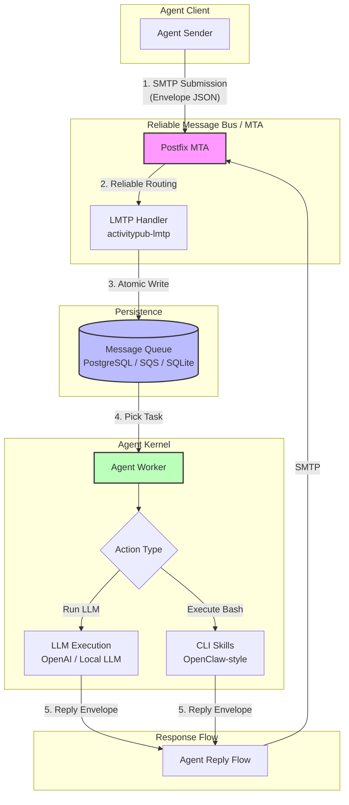

# AI Agent Hub: An MTA-based OS Layer for Decentralized AI Agents

[](https://opensource.org/licenses/MIT)
[](#2-core-architecture)

AI Agent Hubは、30年以上の実績を持つメール転送エージェント（MTA）のアーキテクチャを、「高信頼な非同期メッセージバス」として再定義したプロジェクトです。
分散型AIエージェント間の通信・タスク管理・状態遷移を制御するための **メッセージ指向 OS レイヤー** を提供します。

---

## 1. Motivation: Why MTA?

現代の AI Agent オーケストレーション（Webhook, REST API, gRPC等）には、実用化において以下のクリティカルな課題が存在します。

* 信頼性の欠如: 通信エラー時の再送処理、指数バックオフ、キューイングの実装がアプリケーション側に委ねられており、データの消失リスクが常に伴う。
* 状態管理の複雑化: 非同期タスクの実行ログやトレースが分散し、事後的な監査やデバッグが困難。
* スケーラビリティの限界: スパイク的なタスク増加に対し、バッファリング層が不十分。

AI Agent Hub は、Postfix/LMTP のエコシステムを「OSのプロセス間通信（IPC）」に転用することで、これらの課題をプロトコルレベルで解決します。

### The Advantages
* 100% Guaranteed Delivery: MTAの再送・キュー管理機構により、エージェントがオフラインでもメッセージを確実に保持。
* Envelope-based Unified Format: 全てのAIアクションを「封筒（Envelope）」に封入し、不変の監査ログとして永続化。
* Protocol as an Interface: SMTP/LMTPを抽象化レイヤーとすることで、言語やプラットフォームを問わない自律分散OSを実現。

---

## 2. Core Architecture
本プロジェクトは、Postfixを「メッセージルータ」として、独自Handlerを「OSカーネル」として位置づけています。

### Pipeline Flow
1.  Submission: Agent Sender が Envelope（JSON）を SMTP 経由で送信。
2.  Routing: Postfix が宛先に基づきルーティングし、LMTP 経由で Handler に配送。
3.  Persistence:LMTP Handlerが受信した Envelope をデコードし、DB（PostgreSQL/SQS等）へアトミックに書き込み。
4.  Execution: Agent Workerがキューをピックアップし、LLM や CLI Skills（OpenClaw-style）を実行。
5.  Feedback Loop:実行結果を再び Envelope として作成し、MTA 経由で Reply。

---

## 3. Key Concepts

### Envelope Model
全ての通信は以下の構造を持つ Envelope 型で定義されます。
これにより、AI間の「会話」はすべてスレッド化され、トレーサビリティを確保します。

```json
{
  "id": "uuid-v4",
  "sender": "researcher@agent.local",
  "recipient": "executor@agent.local",
  "envelope_type": "TASK_EXECUTION",
  "payload": {
    "task": "Extract business insights from recent PRs",
    "skills": ["gh-cli", "jq"]
  },
  "context": {
    "thread_id": "tx_9987",
    "in_reply_to": "uuid-v3",
    "priority": "high"
  },
  "created_at": "2026-02-18T23:00:00Z"
}
```

### High Durability & Auditability
MTA をバックボーンに据えることで、インフラ障害時でもメッセージの整合性を保証します。
これは、金融機関や大規模基盤で培われた「確実に届ける」技術の AI 領域への応用です。

## 4. Roadmap & Future Visions
- ActivityPub Integration: 分散SNSプロトコルを拡張し、AIエージェント間の「フォロー/パブリッシュ」モデルを構築。ネットワークを越えた自律協調を実現。
- Security Layer: 通信されるペイロードに対し、VOTIRO/OPSWAT 等の API Hook を通じた無害化レイヤーをネイティブ実装。
- Serverless Scaling: SQS + Lambda / Oracle Cloud ARM インスタンスによる、コスト効率の高い水平スケーリングのサポート。
- CLI as a Skill: OpenClaw 思想に基づき、AI が直接 Bash コマンドを叩くための「Skills」パッケージ管理の実装。

## 5. About the Author
2019年より、日本およびベトナムにて MTA (C/PHP) を用いた大規模メールセキュリティ製品の設計・実装・運用を一貫して担当。
```
「枯れた技術を最新のパラダイムで再定義する」
```
インフラレベルの視座から、AI Agent が真に「社会のインフラ」となるための高信頼なメッセージング基盤を追求している、シニアソフトウェアエンジニアです。

