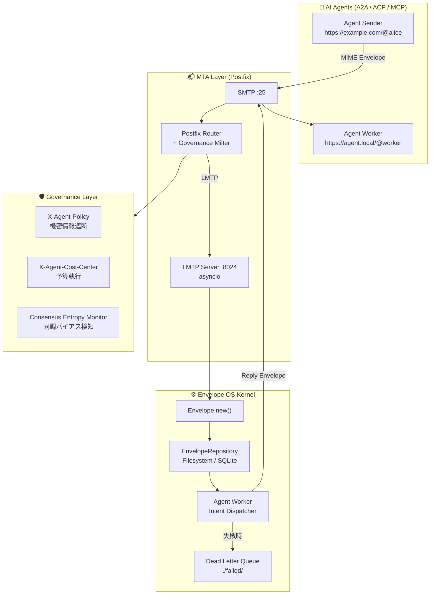

# AI Agent Hub — Envelope OS
### v0.4 | "The SMTP for the Agentic Era."

[](https://opensource.org/licenses/MIT)
[](#技術アーキテクチャ)
[](https://www.python.org/)
[](#ロードマップ)

> AI知能（Brain）と社会（Reality）を繋ぐ、エージェント専用の分散型ガバナンス・メッセージングOS。

---

## プロジェクトビジョン：Governance over Intelligence

2026年、AIエージェントは単なる「チャットボット」から「自律的な労働力」へと進化しました。しかし、企業導入における最大の障壁は「知能の欠如」ではなく「ガバナンスの不在」です。

AI Agent Hub（Envelope OS）は、SMTP/MIMEプロトコルを基盤に、AIエージェントの挙動を「物理的」かつ「数理的」に制御するレイヤーを提供します。知能（LLM）の外側に物理的な規律（Policy）と不変の記録（Audit）を配置することで、エージェントを社会に実装可能な「責任ある資産」へと変革します。

---

## 理論的基盤：「エラーの共鳴」を断ち切る

本プロジェクトは、現在の「複数AIによる相互チェック（Multi-Agent Debate）」が抱える数学的限界に対するカウンターパンチとして設計されています。

### 1. 統計的同調バイアスの排除

同じ学習データを持つAI同士を戦わせても、エラーの相関（共分散）　Cov(X_i, X_j) > 0 により、システム全体の分散は二次関数的に爆発し、「集団催眠的なハルシネーション」に陥ります。

$$\text{Var}\left(\sum_{i=1}^{n} X_i\right) = \sum_{i=1}^{n} \text{Var}(X_i) + \sum_{i \neq j} \text{Cov}(X_i, X_j)$$

### 2. エントロピー・インジェクション

Hubはメッセージの類似度を監視し、多様性が失われた（エントロピーが低下した）瞬間に、外部の確定情報（Ground Truth）や逆説的なコンテキストを強制注入し、推論の枝を物理的に分岐させます。

---

## 主要機能：2026 Standard

### 📩 MIME-Based Agent Messaging

JSON APIではなく、SMTP/MIMEを採用。

- Auditability：配送された「封筒（Envelope）」そのものが改ざん不能な証拠として残る
- Interoperability：既存のメールインフラ、セキュリティ製品、アーカイブツールと無改造で統合可能

### 🛡️ AI Governance Stack（AIGS）Compliance

```
X-Agent-Policy: confidential=block, pii=mask
X-Agent-Workflow: spec-approval-required=true
```

- X-Agent-Policy：組織外への機密漏洩を配送レイヤーで物理遮断
- X-Agent-Workflow（cafekit）：「設計書（Spec）承認なしのコーディング」を禁止するSDD（Spec-Driven Development）の強制

### 💰 Programmable Economy（Circle Integration）

Circle社のUSDC決済をプロトコルに統合。

```
X-Agent-Payment-Required: amount=0.10USDC, recipient=agent.local/@executor
```

メール1通で「業務依頼・決済・領収書発行」を完結。AIが自ら予算を管理し、経済活動を行う基盤を提供します。

### 🖥️ Physical Grounding（MiroFish / gstack）

- MiroFish：GUI操作エージェントとの連携による、レガシーシステムの自動化
- gstack：役割分担されたエージェント群によるエンタープライズ級ソフトウェア開発のオーケストレーション

---

## 技術アーキテクチャ



---

## Envelope Model

```json
{
  "id": "uuid-v4",
  "sender": "https://example.com/@researcher",
  "recipient": "https://agent.local/@executor",
  "envelope_type": "TASK_EXECUTION",
  "payload": {
    "intent": "llm-query",
    "text": "競合他社の最新動向を調査してください"
  },
  "context": {
    "thread_id": "tx_9987",
    "in_reply_to": "uuid-v3",
    "priority": "high",
    "cost_center": "research_dept",
    "policy": "internal_only"
  },
  "created_at": "2026-03-19T00:00:00Z"
}
```

---

## ロードマップ

| Phase | Architecture | Focus |
|-------|-------------|-------|
| Phase 1（現在）　| Python / Linux / Postfix | Core Logic & Protocol Definition |
| Phase 2（移行） | AWS Serverless Stack | Scalability & High Availability（99.99%） |
| Phase 3（Enterprise） | KMS / CloudTrail Integration | Immutable Audit Trail & Financial Compliance |

### Phase 1 実装状況

- ✅ LMTP Server（asyncio）
- ✅ Envelope Model + Agent Worker
- ✅ Dead Letter Queue
- ✅ `llm-query` intent（OpenAI連携）
- ✅ EnvelopeRepository（Filesystem / SQLite）
- 📋 Governance Milter（AIGS Compliance）
- 📋 Circle/USDC Payment Gateway
- 📋 Consensus Entropy Monitor

---

## クイックスタート

```bash
git clone https://github.com/raberabe1121/ai-agent-os.git
cd ai-agent-os
pip install -e .

# LMTPサーバー起動
python -m ai_agent_hub.lmtp_server

# Agent Worker起動（別ターミナル）
python -m ai_agent_hub.agent_worker

# Envelopeを送信
python -c "
from ai_agent_hub import Envelope
from ai_agent_hub.smtp_sender import send_envelope_via_smtp

env = Envelope.new(
    envelope_type='TASK',
    sender='https://myapp.local/@orchestrator',
    recipient='https://myapp.local/@worker',
    payload={'intent': 'ping'}
)
send_envelope_via_smtp(env)
print('Envelope sent:', env.id)
"
```

### SQLiteモードで起動

```bash
export AI_AGENT_HUB_STORAGE=sqlite
export AI_AGENT_HUB_SQLITE_PATH=./agent_hub.db
python -m ai_agent_hub.lmtp_server
```

---

## 業界標準プロトコルとの棲み分け

A2A（Google）やACP（IBM）が「どう通信するか」を定義するのに対し、Hubは「通信の履歴をどう永続化し、どう監査するか」というOS的な機能を担います。

| 比較項目 | A2A / ACP | AI Agent Hub |
|---------|-----------|-------------|
| トランスポート | HTTPS（同期） | SMTP/LMTP（非同期） |
| 主な関心事 | 通信の構造・認証 | 配送保証・永続化・監査 |
| 立ち位置 | 「言語（Protocol）」 | 「物流網 + 法律（OS）」 |

> A2AやACPが普及するほど、「それを安全に運用するための基盤」としてAI Agent Hubの需要が生まれます。これは競合ではなく**共進化**です。

---

## ライセンス

MIT — 詳細は [LICENSE](LICENSE) を参照してください。
